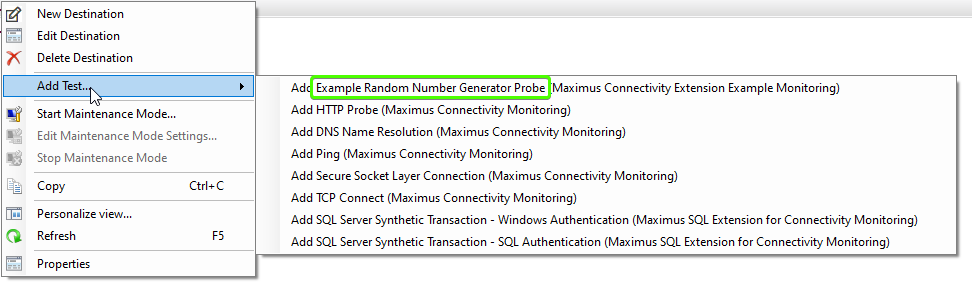
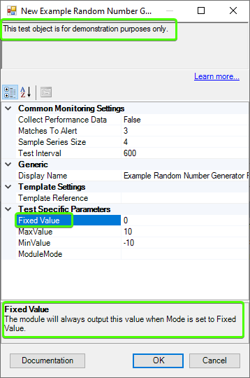

# Extending Maximus Connectivity Monitoring solution
### How to create more test objects and monitors to extend featues of the Maximus Connectivity Monitoring SCOM management pack

In this manual, I'm going to explain, step-by-step how more test can be added to the the Maximus Connectivity Monitoring SCOM management pack.
You can find the original MP at : https://github.com/MaxxVolk/Maximus.Connectivity.Monitoring.

## Prerequisites:
You can use different tools to create a SCOM management pack, starting from simple Notepad application, or using special
design tools like Silect MP Author/Studio. However, in this manual, I'm using the most powerful combination of 
Microsoft Visual Studio (you can use any edition) and VSAE (Visual Studio Authoring Extension). You can download both
tools from Microsoft web site.

Visual Studio: https://visualstudio.microsoft.com/

VSAE: http://www.microsoft.com/en-nz/download/details.aspx?id=30169

*Note: This manual is created using Microsoft Visual Studio Community 2019 and VSAE version 1.4.1.0.**

## 1. Create solution.
First, let's prepare a solution containing two projects: SCOM 2012 R2 Management Pack and .Net Framework Class 
Library.

*Note: This example uses managed module to implement Probe Action for actual monitoring probe. However, in your
project you can use PowerShell, or VB/JS scripts, or external commands to implement your mounting probe.*

*Note: The managed module in this example is based on the base classes from the https://github.com/MaxxVolk/Maximus.Base.Library base library.
However, you can either use either PowerShell, or VB/JS scripts, as mentioned earlier, or implement your
own managed module. To do so, you may refer to my other article at: http://maxcoreblog.com/2020/07/23/implementing-scom-managed-modules-part-1/*

Open Visual Studio and select _Create a new project_:


Type "blank" in the search project type bar (1), then select "Blank Solution" (2) and click _Next_ (3).


When the new solution is created add two projects. Bring the solution explorer, if it's not on the screen (_View->Solution Explorer or
Ctrl+Alt+L_). Then right click the solution and select _Add -> New Project_ from the context menu.


As before search for "Operations Manager 2012 R2 Management Pack" 
(this project type is not available through any filter), then add this project. Then add another project and
search (or select) for Class Library (.Net Framework) project type.

**NB!** Management Pack projects and associated class libraries always should be compiled in _Release_ mode.

Change active build configuration to _Release_. Either simply select _Release_ at the standard toolbar, or bring 
up Configuration Manager: _Build -> Configuration Manger_, then change _Active solution configuration_.


Now, we need to sign both projects. Right click at the class library project and go to Signing tab. Select 
_Sign the assemble_ checkbox (1), then either browse for an existing snk file, or choose _New..._ to create one (2).


Then sign the management pack project. Right click at the management pack project and select _Properties_ from 
the context menu. Go to _Build_ tab. Select _Create sealed and signed management pack_, then browse for snk file. 
It's recommended to reuse the same key file from the previous step.


The class library project will need references to SCOM Agent base libraries, so we need to add them. SCOM SDK
libraries can be found in any installation of SCOM Agent, SCOM Server, or SCOM Gateway. Some libraries are 
available in SCOM Console deployment, but some might be missing. You will need to locate and add references to the 
following DLLs:

  - `Microsoft.EnterpriseManagement.Core.dll`
  - `Microsoft.EnterpriseManagement.HealthService.dll`
  - `Microsoft.EnterpriseManagement.Modules.DataTypes.dll`
  - `Microsoft.EnterpriseManagement.OperationsManager.dll`
  - `Microsoft.Mom.Modules.DataTypes.dll`


Then we need to include the class library resultant DLL file into management pack. To do this, right click 
_References_ node in the MP project sub-tree, and select _Add Reference_. Select _Projects_ tab, and select 
the class library project.


Then, make Visual Studio to include DLL file into compiled MP bundle. Expand References node of the MP project, 
find recently added class library reference, and press F4, or right click ans select _Properties_. Set 
_Package to bundle_ to True.


Another compulsory reference should be made to link the base Connectivity Monitoring MP. Download Maximus
Connectivity Monitoring management pack from GitHub https://github.com/MaxxVolk/Maximus.Connectivity.Monitoring
and reference it in your MP. Right click at _References_ node in the MP project subtree, then select 
_Add Reference from Management Pack Bundle_ (**don't be confused with Add Reference**). Select `Maximus.Connectivity.Monitoring.mpb`
to reference.

Last thing preparing projects, is to add external references (may not be required if you don't use my base library). 
Download the latest base library from GitHub (https://github.com/MaxxVolk/Maximus.Base.Library). Right click at 
the References node in the class library project subtree and select _Add Reference..._ from the menu. Add reference
to Maximus.Base.Library.ManagedWorkflowBase.dll. For the MP project, right click at _References_, then select 
_Add Reference from Management Pack Bundle_ and add reference to `Maximus.Base.Library.mpb`.

Now, both projects are ready to add new elements.

## 2. Create and decorate test object class.
Right click the MP project and select _Add -> New Item..._, then select Empty Management Pack Fragment element type.


For this example, I'm going to create a test object, which will initialize a random number generator. 
So, its corresponding monitor will be compare output number with a set threshold and alert when outside
of boundaries. I'm also going to add a predefined mode, when module will use preset output, rather than randomly 
generated. To define a new class, type the following XML fragment:

```xml
<TypeDefinitions>
  <EntityTypes>
    <ClassTypes>
      <ClassType ID="Maximus.Connectivity.ExampleExtension.ExampleClass" Abstract="false" Accessibility="Public"
                 Base="MCM!Maximus.Connectivity.Monitoring.Test" Hosted="true">
        <Property ID="MinValue" Type="int" DefaultValue="-10"/>
        <Property ID="MaxValue" Type="int" DefaultValue="10"/>
        <Property ID="FixedValue" Type="int" DefaultValue="0"/>
        <Property ID="ModuleMode" Type="enum" EnumType="Maximus.Connectivity.ExampleExtension.ExampleClass.ModuleMode.Enumeration"/>
      </ClassType>
    </ClassTypes>
    <EnumerationTypes>
      <EnumerationValue ID="Maximus.Connectivity.ExampleExtension.ExampleClass.ModuleMode.Enumeration" Accessibility="Public"/>
      <EnumerationValue ID="Maximus.Connectivity.ExampleExtension.ExampleClass.ModuleMode.Enumeration.FixedValue" Accessibility="Public"
                        Parent="Maximus.Connectivity.ExampleExtension.ExampleClass.ModuleMode.Enumeration"/>
      <EnumerationValue ID="Maximus.Connectivity.ExampleExtension.ExampleClass.ModuleMode.Enumeration.RandomValue" Accessibility="Public"
                        Parent="Maximus.Connectivity.ExampleExtension.ExampleClass.ModuleMode.Enumeration"/>
    </EnumerationTypes>
  </EntityTypes>
</TypeDefinitions>
```

The new test object class has mode switch property `ModuleMode`, and corresponding enumeration definition 
`ModuleMode.Enumeration`. Then it has three properties, one is `FixedValue` for fixed value in Fixed Value Mode, 
and two are `MinValue` and `MaxValue` for Random Value mode.

Another very important fact about the test object class is its `Hosted="true"` attribute. In the base
Maximus Connectivity Monitoring class the base abstract class `Maximus.Connectivity.Monitoring.Test` is also
marked as hosted, but what is important, the base MP defines a relationship, which says that `Maximus.Connectivity.Monitoring.Test`
class and all its children are hosted at the 'Maximus.Connectivity.Monitoring.FullyQualifiedDomainName' class instances.
This has few important consequences:
 
  - An instance of test object class must be always linked to an instance of the destination FQDN class.
  - An instance of test object class have access to host instance properties, i.e. destination DNS name.
  - All test objects hosted at the same destination object are handled by the same action point (i.e. SCOM Agent).

Next step is to properly document (decorate) the test object class. To do this, you need to create a language pack
fragment. It may be located in the same file. In this case, language pack session should be placed after type 
definition one. Let's create a core template for it.

```xml
<LanguagePacks>
  <LanguagePack ID="ENU" IsDefault="true">
    <DisplayStrings>
      <!-- Enumeration: Maximus.Connectivity.ExampleExtension.ExampleClass.ModuleMode.Enumeration -->
      <DisplayString ElementID="Maximus.Connectivity.ExampleExtension.ExampleClass.ModuleMode.Enumeration.FixedValue">
        <Name>Fixed Value</Name>
        <Description>Module will output a constant value.</Description>
      </DisplayString>
      <DisplayString ElementID="Maximus.Connectivity.ExampleExtension.ExampleClass.ModuleMode.Enumeration.RandomValue">
        <Name>Random Value</Name>
        <Description>Module will output a random value.</Description>
      </DisplayString>
      
      <!-- Class: Maximus.Connectivity.ExampleExtension.ExampleClass -->
      <DisplayString ElementID="Maximus.Connectivity.ExampleExtension.ExampleClass">
        <Name>Example Random Number Generator Probe</Name>
        <Description>This test object is for demonstration purposes only.</Description>
      </DisplayString>
      <DisplayString ElementID="Maximus.Connectivity.ExampleExtension.ExampleClass" SubElementID="FixedValue">
        <Name>Fixed Value</Name>
        <Description>The module will always output this value when Mode is set to Fixed Value.</Description>
      </DisplayString>
    </DisplayStrings>
    <KnowledgeArticles>
      <KnowledgeArticle ElementID="Maximus.Connectivity.ExampleExtension.ExampleClass">
        <MamlContent>
          <section xmlns="http://schemas.microsoft.com/maml/2004/10">
            <title>Description</title>
            <para>
              Text is here.
            </para>
          </section>
        </MamlContent>
      </KnowledgeArticle>
    </KnowledgeArticles>
  </LanguagePack>
</LanguagePacks>
```

In this fragment I create class name and description. Class name will be used in the UI _Add Test..._ context
menu, and class description will be shown in the description area of _New Test Object_ dialog as shown on the
screenshots below. Note, that only `FixedValue` property has proper name and description. This is because
display string elements are missing for other properties. 





The _Learn more..._ label and _Documentation_ button are active at the screenshot above, and this is because
there is knowledge article element defined for the test object. As it's shown below, the _Documentation_ window 
shows exactly the same content, I put into the knowledge article element.


Similarly, enumeration value names and their descriptions are picked from respective display string elements.


Now it's time to add more display strings for the rest of the object properties and put proper description into the
knowledge article. After this, my test object is ready.

## 3. Create Probe Action managed module in C#.

At this stage, I'm going to implement a Probe Action managed module. It does two main tasks: loads configuration
and produce an output data. Normally, output data is a result of test or probe, but in this demo, it's just a random
number. So, right click at the class library project, and select _Add -> Class..._. Name the new class as 
`ExampleClassPA`. Then let's create class' skeleton. Write the following code:

```csharp
using Maximus.Library.ManagedModuleBase;

using Microsoft.EnterpriseManagement.HealthService;
using Microsoft.EnterpriseManagement.Mom.Modules.DataItems;

using System;
using System.Xml;

namespace Maximus.Connectivity.ExampleExtension.Modules
{
  [MonitoringModule(ModuleType.ReadAction)]
  [ModuleOutput(true)]
  class ExampleClassPA : ModuleBaseSimpleAction<PropertyBagDataItem>
  {
    private string TestDisplayName, FullyQualifiedDomainName;
    private int TargetIndex;

    public ExampleClassPA(ModuleHost<PropertyBagDataItem> moduleHost, XmlReader configuration, byte[] previousState) : base(moduleHost, configuration, previousState)
    {
    }

    protected override PropertyBagDataItem[] GetOutputData(DataItemBase[] inputDataItems)
    {
      try
      {

      }
      catch (Exception e)
      {
        // Log error here
      }
    }

    protected override void ModuleErrorSignalReceiver(ModuleErrorSeverity severity, ModuleErrorCriticality criticality, Exception e, string message, params object[] extaInfo)
    {
      // log parent class errors here
    }

    protected override void LoadConfiguration(XmlDocument cfgDoc)
    {
      try
      {
        // base class properties
        LoadConfigurationElement(cfgDoc, "TestDisplayName", out TestDisplayName, "<no test name provided>", false); // for logging purposes only
        // parent class property
        LoadConfigurationElement(cfgDoc, "FullyQualifiedDomainName", out FullyQualifiedDomainName);
        LoadConfigurationElement(cfgDoc, "TargetIndex", out TargetIndex);
        // specific class properties -- none
      }
      catch (Exception e)
      {
        ModuleErrorSignalReceiver(ModuleErrorSeverity.FatalError, ModuleErrorCriticality.Stop, e, "Failed to load module configuration.");
        throw new ModuleException("Failed to load module configuration.", e);
      }
    }
  }
}
```

The code above is a minimum frame for any probe action plus it already has some configuration loading
code specific to target destination object, where our test object is hosted. These configuration properties
won't be used in this example, but they are important for any real test, especially the `FullyQualifiedDomainName`
property, which is destination DNS name/IP for any connectivity tests.

Next step is to add code to load properties specific to my test object. Let's do this. First, add more private 
fields to the class definition. It's better to name them same as management pack class properties to avoid any
confusion.

```csharp
    private int MinValue, MaxValue, FixedValue;
    private Guid ModuleMode;
```

and then add the following code to the `LoadConfiguration(XmlDocument cfgDoc)` method:

```csharp
        // specific class properties -- some
        LoadConfigurationElement(cfgDoc, "MinValue", out MinValue, defaultValue: -10, Compulsory: false);
        LoadConfigurationElement(cfgDoc, "MaxValue", out MaxValue, defaultValue: 10, Compulsory: false);
        LoadConfigurationElement(cfgDoc, "FixedValue", out FixedValue, defaultValue: 0, Compulsory: false);
        LoadConfigurationElement(cfgDoc, "ModuleMode", out ModuleMode, defaultValue: "{00000000-0000-0000-0000-000000000000}", Compulsory: false);

        // probe action is persistent, i.e. always loaded into memory.
        // It reloads only is configuration changes. Therefore, we can create Random object just once.
        random = new Random();
```

Note, that all properties are marked as not compulsory. This is made to avoid any problems if test object properties
are set incorrectly. If you find a missing property, it's better to log an error in logs, rather than cause an
exception for missing parameter. For same reason, default values are set to the same values as in the class definition.

There is also another line of code, which creates Random object. It's possible to make it in the `LoadConfiguration(XmlDocument cfgDoc)`
method, because probe action is persistent, i.e. always loaded into memory.

The last thing I need to do before I can actually implement the probe (i.e. write some meaningful code to the 
`PropertyBagDataItem[] GetOutputData(DataItemBase[] inputDataItems)` method) is to find actual enumeration
values. Note, that SCOM agent passes enum values as `Guid`. Let's start _Operations Manager Shell_ and run the
following PowerShell script:

```powershell
$class = Get-SCOMClass -Name Maximus.Connectivity.ExampleExtension.ExampleClass
$enumId = $class.PropertyCollection["ModuleMode"].EnumType.Id
$class.ManagementGroup.EntityTypes.GetChildEnumerations($enumId, [Microsoft.EnterpriseManagement.Common.TraversalDepth]::OneLevel) | ft id, DisplayName
```

It's output will be (believe me or not) exactly the same as below. This is because SCOM ids are not random, see
my blog post on this mater at http://maxcoreblog.com/2019/05/02/are-scom-ids-random/. And this is why I can safely 
use `Guid` constants, rather then querying SCOM for enum Ids each time.

```txt
Id                                   DisplayName
--                                   -----------
1ed90ec7-5063-bfe9-c1bd-99b31bc5984c Random Value
94f9cff7-eb44-dbd9-8cea-712234c667b8 Fixed Value
```

So now, I can finalize my probe action by writing the following:

```csharp
    private Random random;
    private readonly Guid RandomMode = new Guid("1ed90ec7-5063-bfe9-c1bd-99b31bc5984c");
    private readonly Guid FixedMode = new Guid("94f9cff7-eb44-dbd9-8cea-712234c667b8");
    protected override PropertyBagDataItem[] GetOutputData(DataItemBase[] inputDataItems)
    {
      try
      {
        if (ModuleMode == FixedMode)
          return new PropertyBagDataItem[] { CreatePropertyBag("Value", FixedValue) };
        if (ModuleMode == RandomMode)
          return new PropertyBagDataItem[] { CreatePropertyBag("Value", random.Next(MinValue, MaxValue)) };
        return null;
      }
      catch (Exception e)
      {
        // Log error here
        return null;
      }
    }
```

And it's ready to move to the next stage.

## 4. Wrap managed module in management pack XML.
Now I need to let SCOM know how to call my .Net code. To do so, I need to define a Probe Action module type,
but before doing this, I need to register the containing class library as Deployable Assembly.
Let's add another empty management pack fragment and call it `Assemblies.mpx` (In the latest VSAE version
Microsoft added support for deployable assembly templates, however, I prefer use manual coding when I need to change
version often -- the template doesn't update DLL version easy). Then I put the following XML into the new file.
This let SCOM engine know, that my management pack contains a library, which should be delivered to all SCOM
Agents.

For whom, who tried to type this code, they may notice that there is also just Assembly resource type. This describes
a DLL, which should be delivered to SCOM Console deployments -- it contains console extensions. This is why the 
parent Connectivity Monitoring MP has both resource types. One with test object probes, and another implementing 
the UI.

```xml
<Resources>
  <DeployableAssembly ID="Maximus.Connectivity.ExampleExtension.Monitoring.Modules.DeployableAssembly" HasNullStream="false"
                      QualifiedName="Maximus.Connectivity.ExampleExtension.Modules, Version=1.0.0.0, Culture=neutral, PublicKeyToken=fd5098a6a3259696"
                      FileName="Maximus.Connectivity.ExampleExtension.Modules.dll" Accessibility="Internal">
  </DeployableAssembly>
</Resources>
```

Next I create another empty fragment and call it `Modules.mpx`. In the end of the "making of" article 
http://maxcoreblog.com/2021/01/11/connectivity-monitoring-scom-management-pack-the-making-of/, defined few
guidelines, so, according to them, I'm creating Native and Normal probe action version. The native probe action is 
the most root definition describing input and output data item types, configuration parameters, and implementation 
class. Note, that `guid` is passed as `string`. This is because SCOM has `guid` as allowed class property type,
but XML schema doesn't support `guid`. Also note, that the module visibility is set to `Internal`, so other 
management packs will not be able to call this module.

```xml
<TypeDefinitions>
  <ModuleTypes>
    <ProbeActionModuleType ID="Maximus.Connectivity.ExampleExtension.ExampleClass.Random.NativeProbeAction" Accessibility="Internal" >
      <Configuration>
        <xsd:element minOccurs="1" name="TestDisplayName" type="xsd:string" />
        <xsd:element minOccurs="1" name="FullyQualifiedDomainName" type="xsd:string" />
        <xsd:element minOccurs="1" name="TargetIndex" type="xsd:integer" />
        <xsd:element minOccurs="1" name="MinValue" type="xsd:integer" />
        <xsd:element minOccurs="1" name="MaxValue" type="xsd:integer" />
        <xsd:element minOccurs="1" name="FixedValue" type="xsd:integer" />
        <xsd:element minOccurs="1" name="ModuleMode" type="xsd:string" />
      </Configuration>
      <OverrideableParameters />
      <ModuleImplementation>
        <Managed>
          <Assembly>Maximus.Connectivity.ExampleExtension.Monitoring.Modules.DeployableAssembly</Assembly>
          <Type>Maximus.Connectivity.ExampleExtension.Modules.ExampleClassPA</Type>
        </Managed>
      </ModuleImplementation>
      <OutputType>System!System.PropertyBagData</OutputType>
      <InputType>System!System.BaseData</InputType>
    </ProbeActionModuleType>
  </ModuleTypes>
</TypeDefinitions>
```

Next turn is for Normal probe action. This probe action gets properties form test object and passes them to
the native probe action. It's defined as:

```xml
<ProbeActionModuleType ID="Maximus.Connectivity.ExampleExtension.ExampleClass.Random.ProbeAction" Accessibility="Public">
  <Configuration />
  <OverrideableParameters/>
  <ModuleImplementation>
    <Composite>
      <MemberModules>
        <ProbeAction ID="PA_SubstituteParametersFromObject" TypeID="Maximus.Connectivity.ExampleExtension.ExampleClass.Random.NativeProbeAction">
          <TestDisplayName>$Target/Host/Property[Type="System!System.Entity"]/DisplayName$</TestDisplayName>
          <FullyQualifiedDomainName>$Target/Host/Property[Type="MCM!Maximus.Connectivity.Monitoring.FullyQualifiedDomainName"]/FullyQualifiedDomainName$</FullyQualifiedDomainName>
          <TargetIndex>$Target/Host/Property[Type="MCM!Maximus.Connectivity.Monitoring.FullyQualifiedDomainName"]/TargetIndex$</TargetIndex>
          <MinValue>$Target/Property[Type="Maximus.Connectivity.ExampleExtension.ExampleClass"]/MinValue$</MinValue>
          <MaxValue>$Target/Property[Type="Maximus.Connectivity.ExampleExtension.ExampleClass"]/MaxValue$</MaxValue>
          <FixedValue>$Target/Property[Type="Maximus.Connectivity.ExampleExtension.ExampleClass"]/FixedValue$</FixedValue>
          <ModuleMode>$Target/Property[Type="Maximus.Connectivity.ExampleExtension.ExampleClass"]/ModuleMode$</ModuleMode>
        </ProbeAction>
      </MemberModules>
      <Composition>
        <Node ID="PA_SubstituteParametersFromObject" />
      </Composition>
    </Composite>
  </ModuleImplementation>
  <OutputType>System!System.PropertyBagData</OutputType>
  <InputType>System!System.BaseData</InputType>
</ProbeActionModuleType>
```

Few notes here. 
  
  - This is a composite module type. That means it's made as a combination of already existing module. In this case, it's a combination of the single module type.
  - Prefixes like `System!` or `MCM!` are aliases of referenced management packs. Strictly speaking, management pack element IDs are not unique. More correctly, they are unique within a single management pack, but not between. In other words, you can define a class named `Microsoft.Windows.Computer` in your management pack, and this is legitimate. But after this, result of PowerShell command like `Get-SCOMClass -Name Microsoft.Windows.Computer` is unpredictable. This is why you must explicitly point to destination management pack.
  - Everything between two dollar signs is called _Management Pack Element Reference_.
  - MP Reference like `$Target/Host{0-N}/Property[Type="ClassName"]/PropertyName$` reference a property value of an instance of target class. So, if we have an instance of the `ExampleClass`, where `MinValue=-99`, SCOM Agent will replace this reference with`-99` when calling my probe action. Because I'm planning to target my future monitor (where this probe action will be a part of) to the `ExampleClass` all properties of `ExampleClass` will be referenced without `/Host` (number of repetition is zero). But `Destination` class is host of `ExampleClass`, so its property values are references with `/Host`.
  - `Composition` section always contains nested `Node` nodes. SCOM Agent executes them from the most nested (the innermost).

Next step is to convert the normal probe action into a data source. To make this, I'll combine an existing scheduler
data source (which isn't really a source of some data, but just issues a triggering empty data item over fixed 
period of time) with my normal probe action. I'll use another class value property reference, but to a property of 
parent class of `ExampleClass`, which is `MCM!Maximus.Connectivity.Monitoring.Test`. Note, there no `/Host`
required, because this is parent, not host class.

**NB!** Don't get confused between host/hosted/hosting relationship and parent/child classes. Hosting describes 
relationship between independent object in the same way as I can say: _web page is hosted at web server, web server
hosted at virtual machine, virtual machine is hosted at hypervisor,  hypervisor is hosted at hardware._ By the way,
if, in this example, I delete the hardware, this will delete everything including the web page. Same is in SCOM.
Applying to this subject, deleting a destination, will delete all hosted test objects. In contrast, parent/child 
classes are about class inheritance, like in any object-oriented programming language.

Getting back to the main topic, the Data Source module XML is:

```xml
<DataSourceModuleType ID="Maximus.Connectivity.ExampleExtension.ExampleClass.Random.DataSource" Accessibility="Public">
  <Configuration />
  <OverrideableParameters />
  <ModuleImplementation>
    <Composite>
      <MemberModules>
        <DataSource ID="DS_Scheduler" TypeID="System!System.SimpleScheduler">
          <IntervalSeconds>$Target/Property[Type="MCM!Maximus.Connectivity.Monitoring.Test"]/IntervalSeconds$</IntervalSeconds>
          <SyncTime />
        </DataSource>
        <ProbeAction ID="PA_Random" TypeID="Maximus.Connectivity.ExampleExtension.ExampleClass.Random.ProbeAction" />
      </MemberModules>
      <Composition>
        <Node ID="PA_Random">
          <Node ID="DS_Scheduler" />
        </Node>
      </Composition>
    </Composite>
  </ModuleImplementation>
  <OutputType>System!System.PropertyBagData</OutputType>
</DataSourceModuleType>
```

Notes:

  - Unlike many other interval Data Source modules, I didn't make interval overrideable parameter. This is because it's defined in test object, first, and second, this will keep cookdown working (see my article on cookdown experiments: http://maxcoreblog.com/2020/08/05/implementing-scom-managed-modules-part-2/)
  - Data Source modules don't have inputs, so there is no `InputType` section.

## 5. Create Monitor Type for Unit Monitor and Data Source for performance data collection.
This data source module, created in the previous part, is the root common workflow for the planned monitor and performance collection rule.
The monitor will need a monitor type definition, and the performance collection rule will need a data source,
which returns data items if the `System.Performance.Data` type, therefore the existing data source doesn't
suit -- it returns `System.PropertyBagData`.

First, I'm creating another composite data source module, which converts data from property bag into
performance data item. But before doing this, I must add reference to two standard managements packs:
`System.Performance.Library.mp` and `Microsoft.SystemCenter.DataWarehouse.Library.mp`. The Performance Library
MP defines the actual data item type, and a "converter", I'm going to use. The DataWarehouse Library is needed
because performance collection rules should save data into DataWarehouse for reporting.

```xml
<DataSourceModuleType ID="Maximus.Connectivity.ExampleExtension.ExampleClass.Performance.Random.DataSource" Accessibility="Public">
  <Configuration />
  <OverrideableParameters />
  <ModuleImplementation>
    <Composite>
      <MemberModules>
        <DataSource ID="DS_Random" TypeID="Maximus.Connectivity.ExampleExtension.ExampleClass.Random.DataSource" />
        <ConditionDetection ID="CD_CollectionEnabled" TypeID="System!System.ExpressionFilter">
          <!-- comparing as string, because the converter is case sensitive, but when value comes from an object, it's capitalized -->
          <Expression>
            <SimpleExpression>
              <ValueExpression>
                <Value Type="String">$Target/Property[Type="MCM!Maximus.Connectivity.Monitoring.Test"]/CollectPerformanceData$</Value>
              </ValueExpression>
              <Operator>Equal</Operator>
              <ValueExpression>
                <Value Type="String">True</Value>
              </ValueExpression>
            </SimpleExpression>
          </Expression>
        </ConditionDetection>
        <ConditionDetection ID="CD_PerfMapper" TypeID="Perf!System.Performance.DataGenericMapper">
          <ObjectName>Random</ObjectName>
          <CounterName>Value</CounterName>
          <InstanceName />
          <Value>$Data/Property[@Name='Value']$</Value>
        </ConditionDetection>
      </MemberModules>
      <Composition>
        <Node ID="CD_PerfMapper">
          <Node ID="CD_CollectionEnabled">
            <Node ID="DS_Random" />
          </Node>
        </Node>
      </Composition>
    </Composite>
  </ModuleImplementation>
  <OutputType>Perf!System.Performance.Data</OutputType>
</DataSourceModuleType>
```

Few comments as usual:

  - Normally, if a SCOM administrator wants to turn on or off particular performance metric collection, they have to find metric's corresponding collection rule and enable or disable it. Finding right rule might be very challenging. This is why, in my solution, I made all configuration visible in UI. To make use of UI settings, all performance collection rule must make respect to the `CollectPerformanceData` property value, which controls data collection. All rules linked to a test object must be always enabled, but they must drop data (not push in the databases), if test object says "not collect".
  - To make this filtering, a condition detection module is included into this composite data source. Condition detection module, is a module with an input and output, which is either pass data item through if it satisfies conditions, or drop it. So, the first condition with Id `CD_CollectionEnabled` don't let data item through, id user opted to not collect performance data.
  - There is a small trick in the `CD_CollectionEnabled` module: boolean value is being validated as string value. This is certainly a bug in SCOM, but minor.
  - Second condition detection is not an actual condition. This is a converter. It never drops data item (unless it's malformed), but changes its type.

And now it's time to create Monitor Type. And this will be the first module with not-substituted parameters 
and the first module with overridable parameters. And the monitor type won't have much notes. This is because 
there are too many notes to make, but they are about management pack authoring in general, which outside of 
this manual scope. But I wish, one day I will write a book on authoring.

```xml
<UnitMonitorType ID="Maximus.Connectivity.ExampleExtension.ExampleClass.Random.UnitMonitor" Accessibility="Public">
  <MonitorTypeStates>
    <MonitorTypeState ID="InRange" NoDetection="false"/>
    <MonitorTypeState ID="OutOfRance" NoDetection="false"/>
  </MonitorTypeStates>
  <Configuration>
    <xsd:element minOccurs="1" name="MinValue" type="xsd:integer" />
    <xsd:element minOccurs="1" name="MaxValue" type="xsd:integer" />
  </Configuration>
  <OverrideableParameters>
    <OverrideableParameter ID="MinValue" Selector="$Config/MinValue$" ParameterType="int" />
    <OverrideableParameter ID="MaxValue" Selector="$Config/MaxValue$" ParameterType="int" />
  </OverrideableParameters>
  <MonitorImplementation>
    <MemberModules>
      <DataSource ID="DS_Random" TypeID="Maximus.Connectivity.ExampleExtension.ExampleClass.Random.DataSource" />
      <ProbeAction ID="PA_Random" TypeID="Maximus.Connectivity.ExampleExtension.ExampleClass.Random.ProbeAction" />
      <ProbeAction ID="PA_Passthrough" TypeID="System!System.PassThroughProbe" />
      <ConditionDetection ID="CD_InRange" TypeID="System!System.ExpressionFilter">
        <Expression>
          <And>
            <Expression>
              <SimpleExpression>
                <ValueExpression>
                  <XPathQuery Type="Integer">Property[@Name='Value']</XPathQuery>
                </ValueExpression>
                <Operator>GreaterEqual</Operator>
                <ValueExpression>
                  <Value Type="Integer">$Config/MinValue$</Value>
                </ValueExpression>
              </SimpleExpression>
            </Expression>
            <Expression>
              <SimpleExpression>
                <ValueExpression>
                  <XPathQuery Type="Integer">Property[@Name='Value']</XPathQuery>
                </ValueExpression>
                <Operator>LessEqual</Operator>
                <ValueExpression>
                  <Value Type="Integer">$Config/MaxValue$</Value>
                </ValueExpression>
              </SimpleExpression>
            </Expression>
          </And>
        </Expression>
      </ConditionDetection>
      <ConditionDetection ID="CD_OutOfRance" TypeID="System!System.ExpressionFilter.IntervalSuppression">
        <Expression>
          <Or>
            <Expression>
              <SimpleExpression>
                <ValueExpression>
                  <XPathQuery Type="Integer">Property[@Name='Value']</XPathQuery>
                </ValueExpression>
                <Operator>Less</Operator>
                <ValueExpression>
                  <Value Type="Integer">$Config/MinValue$</Value>
                </ValueExpression>
              </SimpleExpression>
            </Expression>
            <Expression>
              <SimpleExpression>
                <ValueExpression>
                  <XPathQuery Type="Integer">Property[@Name='Value']</XPathQuery>
                </ValueExpression>
                <Operator>Greater</Operator>
                <ValueExpression>
                  <Value Type="Integer">$Config/MaxValue$</Value>
                </ValueExpression>
              </SimpleExpression>
            </Expression>
          </Or>
        </Expression>
        <SuppressionSettings>
          <MatchCount>$Target/Property[Type="MCM!Maximus.Connectivity.Monitoring.Test"]/MatchCount$</MatchCount>
          <SampleCount>$Target/Property[Type="MCM!Maximus.Connectivity.Monitoring.Test"]/SampleCount$</SampleCount>
        </SuppressionSettings>
      </ConditionDetection>
    </MemberModules>
    <RegularDetections>
      <RegularDetection MonitorTypeStateID="InRange">
        <Node ID="CD_InRange">
          <Node ID="DS_Random" />
        </Node>
      </RegularDetection>
      <RegularDetection MonitorTypeStateID="OutOfRance">
        <Node ID="CD_OutOfRance">
          <Node ID="DS_Random" />
        </Node>
      </RegularDetection>
    </RegularDetections>
    <OnDemandDetections>
      <OnDemandDetection MonitorTypeStateID="InRange">
        <Node ID="CD_InRange">
          <Node ID="PA_Random">
            <Node ID="PA_Passthrough" />
          </Node>
        </Node>
      </OnDemandDetection>
      <OnDemandDetection MonitorTypeStateID="OutOfRance">
        <Node ID="CD_OutOfRance">
          <Node ID="PA_Random">
            <Node ID="PA_Passthrough" />
          </Node>
        </Node>
      </OnDemandDetection>
    </OnDemandDetections>
  </MonitorImplementation>
</UnitMonitorType>
```

And this was the last bit of XML code in this manual. No boring stuff anymore!

## 6. Create templates for Monitor and Rule.
Final step is to actually create the monitor and the collection rule. Right click the management pack project,
select _Add -> New Item..._ and select _Monitor (Unit)_ template type.


Then edit monitor properties as shown at the screenshot below. The small window is an editor for the 
`Monitor Operational States` property.


The monitor also has set thresholds, which needs to be put into Monitor Configuration as shown below:


Now, add a new Rule (Performance Collection) template, either to the same template window (by right clicking in 
`Templates.mptg` editor window), or to a new template file like with the monitor. Set rule's properties as shown:


## 7. Wrapping up and testing.
Finally, I can build and deploy my example in to SCOM Management Group. When MP is installed, let's test it.
Open SCOM Console, select _Monitoring_ section, go to _Maximus Connectivity Monitoring_ folder, and select 
_Destination State and Editor_ node. Use an existing destination, or add a new one (please refer to the user manual),
then add a new instance of the _Example Random Number Generator Probe_ test object. 
Change the highlighted properties as shown and save.


After a minute or few, health status of the new test object should initialize. Then run Health Explorer and see
the first value:


Let it run for several minutes more, and then click _Performance View_ at the _Tasks Pane_ to ensure that
performance data is collected. Performance View dashboard should look like this. You may need to refresh it 
a couple of times and select appropriate counter, as well as select time range (say last 15 minutes).


Finlay, simply wait until next random value gets our of the monitor thresholds, and ensure that alert is triggered.

## The new extension management pack is ready!